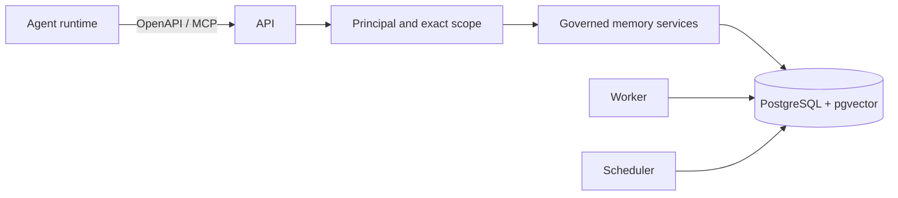

# Stele

Stele is a Go-based, self-hosted agent memory service. It gives an external
agent runtime governed durable memory, exact-scope retrieval, bounded context,
and operational evidence without owning the agent, model calls, prompts, SDK,
or user interface.

PostgreSQL is the only system of record. pgvector supports semantic retrieval,
PostgreSQL full-text search supports lexical retrieval, and memory remains
versioned, attributable, lifecycle-governed, and isolated by tenant, project,
and namespace.

## What Stele provides

- Governed event ingestion and memory intents.
- Canonical memory versions, provenance, lifecycle, and forgetting controls.
- Lexical, semantic, hybrid, and context-oriented retrieval with citations.
- Three deployable runtime modes: API, worker, and scheduler.
- Optional OpenAPI-backed provider and MCP adapters.
- PostgreSQL-backed operational history, conformance, assurance, and recovery
  evidence.

## Architecture at a glance



| Runtime mode | Purpose |
| --- | --- |
| `api` | Request handling, authentication, ingest, retrieval, context, admin, provider, and optional MCP routes |
| `worker` | Lease-aware asynchronous governance, consolidation, lifecycle, and derived work |
| `scheduler` | Periodic retention, compaction, embedding rebuild, cleanup, and assurance dispatch |

Read [Architecture](docs/architecture.md) for request flow and system
boundaries, and [Key components](docs/components.md) for repository ownership
and extension points.

## Quick start

Run the self-hosted stack:

```powershell
Copy-Item .env.local.example .env.local
# Replace placeholders in .env.local before starting the stack.
docker compose --env-file .env.local up --build -d
```

Verify baseline dependency readiness:

```powershell
curl http://localhost:8080/health
curl http://localhost:8080/ready
```

`/ready` confirms baseline dependency readiness only. On a fresh database, use
the bootstrap-admin key from `.env.local` to create a durable admin and an
exact-scope runtime principal before calling protected memory APIs.

Follow the complete bootstrap, migration, embedding, backup, restore, and smoke
instructions in [Self-hosting](docs/self-hosting.md).

## MCP: from startup to first memory call

MCP is optional and disabled by default. Enable it in `.env.local` after the
base stack is healthy:

```dotenv
STELE_MCP_ENABLED=true
STELE_MCP_PATH=/mcp
```

Restart the API runtime, configure your MCP client to call `/mcp` with an
exact-scope principal credential, and start every agent memory task with:

```text
who_am_i -> memory_context or memory_search -> answer with citations
```

Use `memory_remember` for governed durable writes with a reason and idempotency
key. For semantic forgetting, use `memory_forget_preview` first and then apply
only reviewed IDs with `memory_forget_apply`.

The complete setup, current request shapes, tool annotations, limits, and error
handling are in the [MCP integration guide](docs/integrations/mcp-agent-skill.md).

### Agent Skill

The portable, repository-provided Agent Skill is
[skills/stele-memory/SKILL.md](skills/stele-memory/SKILL.md). Copy it into your
agent host's skill directory or include it as repository context. It teaches
safe scope initialization, read selection, governed remember, preview/apply
forgetting, citations, retries, and disabled-MCP recovery.

## MCP tool matrix

| Tool | Use | Safety class |
| --- | --- | --- |
| `who_am_i` | Resolve identity, scope, and binding | read-only, idempotent |
| `memory_search` | Search governed evidence | read-only, idempotent |
| `memory_context` | Assemble bounded context | read-only, idempotent |
| `memory_browse` | Review visible memory | read-only, idempotent |
| `memory_remember` | Submit governed memory intent | idempotent write |
| `memory_forget_preview` | Review semantic forget candidates | read-only, idempotent |
| `memory_forget_apply` | Apply reviewed candidate IDs | destructive, idempotent |
| `memory_forget` | Act on one known memory ID | destructive, idempotent |

## Documentation map

| Reader need | Start here |
| --- | --- |
| Understand system boundaries and data flow | [Architecture](docs/architecture.md) |
| Locate package responsibilities and extension points | [Key components](docs/components.md) |
| Integrate an agent through MCP | [MCP integration and Agent Skill](docs/integrations/mcp-agent-skill.md) |
| Operate memory safely | [Best practices](docs/best-practices.md) |
| Deploy, migrate, back up, and verify | [Self-hosting](docs/self-hosting.md) |
| Integrate a runtime provider | [Agent runtime provider](docs/agent-runtime-memory-provider.md) |
| Migrate Provider context JSON | [Typed context contract and maintenance notes](docs/agent-runtime-memory-provider.md#provider-context-json-contract) |
| Understand public API schemas | [OpenAPI specification](openapi/spec.go) |
| Run optional MCP conformance | [`scripts/stele-mcp-conformance.ps1`](scripts/stele-mcp-conformance.ps1) |
| Review planned and archived changes | [OpenSpec configuration](openspec/config.yaml) |

## Operating principles

- Resolve and retain exact scope before every memory operation.
- Keep PostgreSQL as the only system of record.
- Do not overwrite canonical memory in place; use governed events, intents,
  versions, and lifecycle actions.
- Keep reads lifecycle-safe and citations bounded.
- Use stable idempotency keys for governed writes and destructive operations.
- Treat MCP as an adapter over service contracts, never as direct database
  access.

See [Best practices](docs/best-practices.md) for practical workflows and
recovery guidance.

## Contributing documentation and MCP guidance

When changing an MCP tool, its descriptor, annotation, request shape, or safety
boundary, update all of these in the same OpenSpec change:

1. `internal/mcp/schema.go` and relevant contract tests.
2. [MCP integration guide](docs/integrations/mcp-agent-skill.md).
3. [Agent Skill](skills/stele-memory/SKILL.md).
4. This README tool matrix when the public tool set changes.

Before review, run the documentation check, MCP tests, and strict OpenSpec
validation described in the integration guide. Use `openspec propose`,
`openspec apply`, and `openspec validate --all --strict` for planned work.
