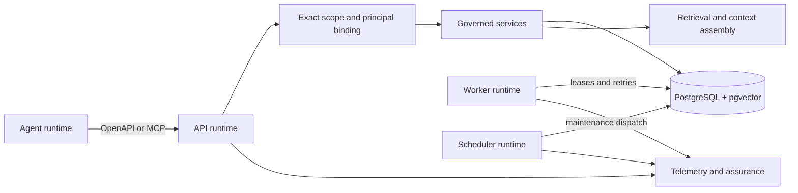

# Stele architecture

Stele is a self-hosted agent memory service. It stores durable memory and
evidence in PostgreSQL, uses pgvector and PostgreSQL full-text search for
retrieval, and exposes governed OpenAPI and optional MCP adapters to an
external agent runtime.

## System shape

The API, worker, and scheduler are separate runtime modes over the same
PostgreSQL system of record. They may be deployed as separate processes or
containers. The service does not execute an agent, call a model, maintain a
client-owned memory database, or make a second persistence system authoritative.

## Runtime modes

| Mode | Owns | Typical responsibilities |
| --- | --- | --- |
| `api` | Synchronous request boundary | Authentication, exact scope resolution, ingest, retrieval, context assembly, provider routes, optional MCP, health/readiness, and admin APIs |
| `worker` | Durable asynchronous processing | Governance, consolidation, derived work, leases, retries, lifecycle transitions, and projection maintenance |
| `scheduler` | Time-based dispatch | Retention, compaction, embedding rebuilds, cleanup, assurance, and maintenance job dispatch |

Workers and schedulers do not bypass the same scope, lifecycle, provenance, and
append-only rules used by API requests.

## Request and memory flow

1. An authenticated principal establishes or presents an exact runtime binding.
2. The boundary resolves `tenant`, `project`, `namespace`, agent, session, and
   optional conversation identity. Caller input cannot widen the binding.
3. Read requests select lifecycle-visible projections and return bounded
   citations or context evidence.
4. Write requests append raw events or submit governed memory intents. They do
   not overwrite canonical memory directly.
5. Worker processing derives candidates and canonical versions asynchronously,
   preserving provenance, version history, and audit records.
6. Retrieval combines PostgreSQL full-text search, optional pgvector search,
   bounded fusion, lifecycle filtering, and exact-scope citations.
7. Maintenance and assurance jobs record bounded state and recovery evidence.

## Persistence boundaries

PostgreSQL is the only system of record. The principal persistence layers are:

- raw events and provenance records;
- candidate and canonical memory projections;
- append-only memory versions and lifecycle history;
- embeddings and retrieval projections;
- durable intent, job, lease, retention, and assurance records.

pgvector is an indexed retrieval capability, not a second source of truth.
PostgreSQL full-text search remains available for lexical-only deployments.

## Governance boundaries

Memory classes remain explicit: `profile`, `episodic`, `procedural`, `summary`,
and `relation`. Lifecycle remains explicit: `event -> candidate -> active`,
with `suppressed`, `forgotten`, and `deleted` outcomes. Canonical memory is
versioned and append-only from the service contract's perspective.

Default retrieval excludes suppressed and forgotten memory. Hidden records are
not restored merely because an agent asks for broader context. Administrative
inspection and lifecycle actions have separate authorization and audit rules.

## Extension points

- OpenAPI is the public contract boundary.
- MCP is an optional adapter over existing governed services.
- Provider synchronization uses transport-neutral cursor semantics; future
  WebSocket or SSE adapters must reuse the same contract.
- Retrieval channels and embedding providers are replaceable behind bounded
  interfaces.
- New memory behavior should enter through an OpenSpec change and preserve the
  PostgreSQL, scope, lifecycle, provenance, and audit constraints in `AGENTS.md`.

See [components](components.md), [best practices](best-practices.md),
[self-hosting](self-hosting.md), and the [provider contract](agent-runtime-memory-provider.md).
